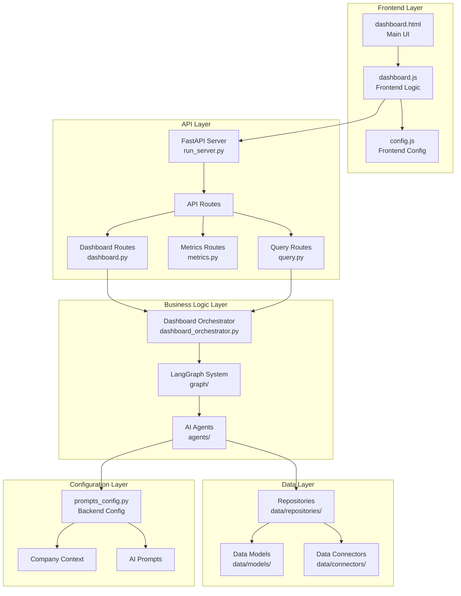
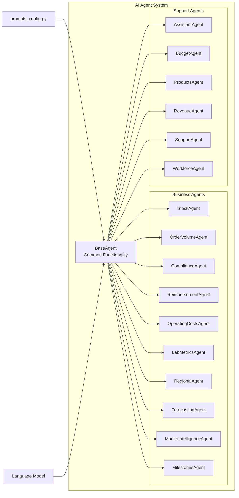
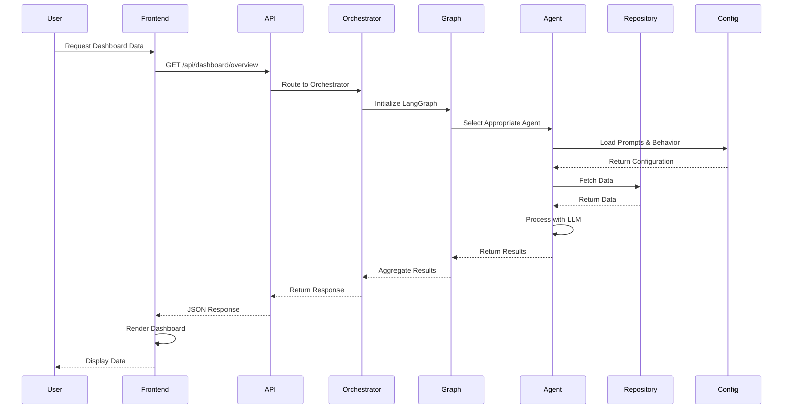
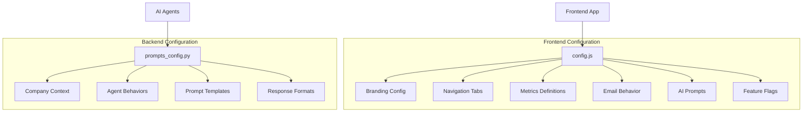
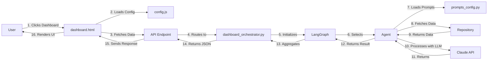
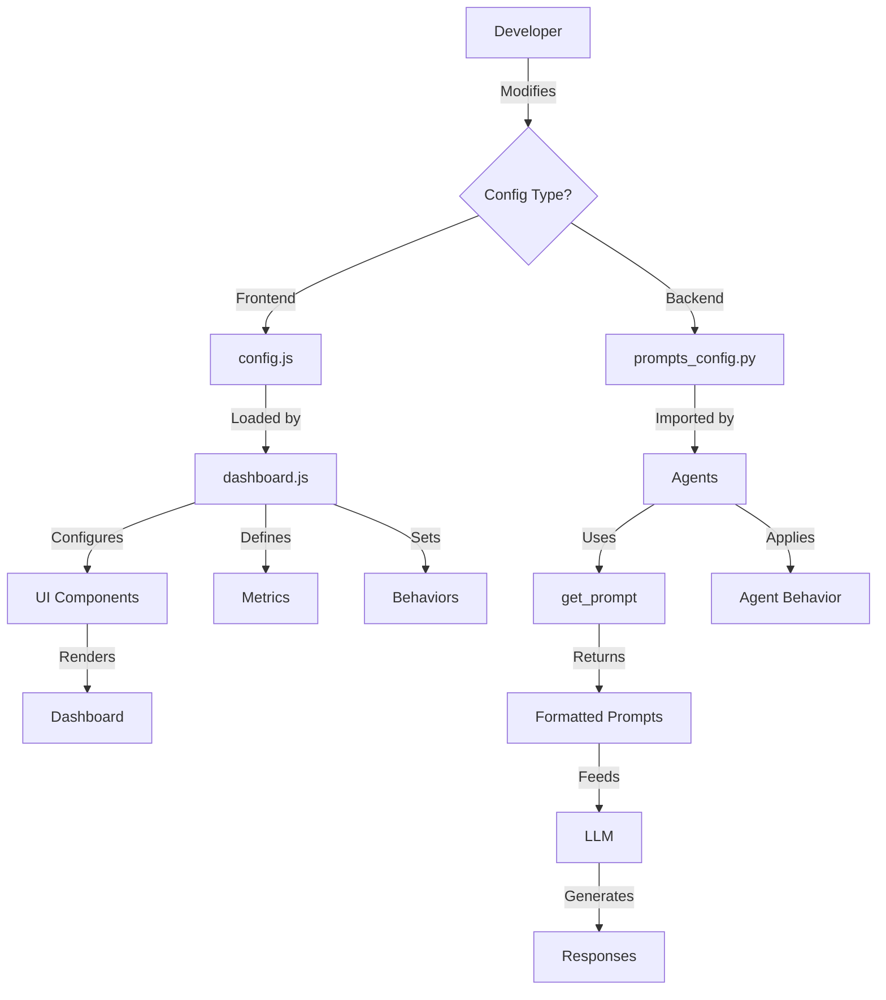
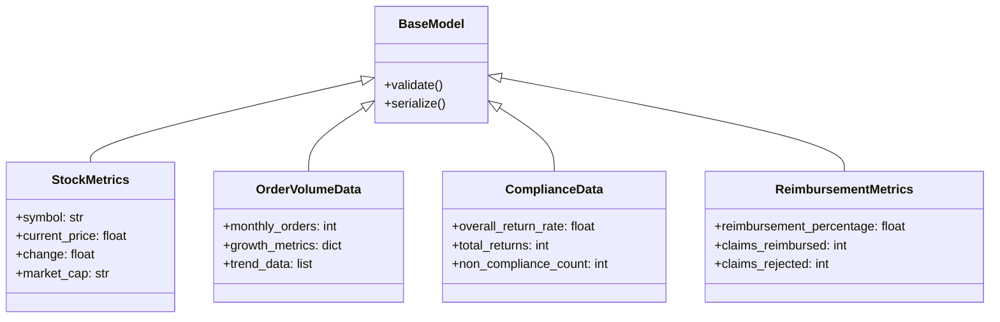
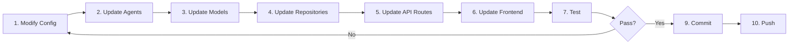
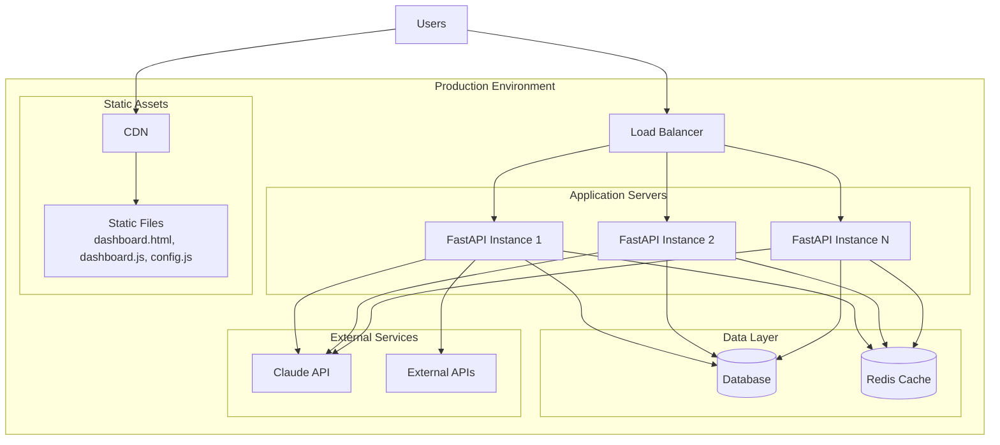

# LeaderDashboard - Complete Project Structure Documentation

## 📋 Table of Contents
- [Project Overview](#project-overview)
- [Architecture Diagrams](#architecture-diagrams)
- [Folder Structure](#folder-structure)
- [File Documentation](#file-documentation)
- [Data Flow](#data-flow)
- [Component Interactions](#component-interactions)

---

## 🎯 Project Overview

**LeaderDashboard** is an AI-powered executive dashboard for HealthCare Sciences providing real-time insights across 15+ business metrics including orders, compliance, reimbursement, operating costs, lab metrics, and more.

**Key Features:**
- 🤖 AI-powered agents for intelligent data analysis
- 📊 15+ interactive dashboard tiles
- ⚙️ Fully configurable via central config files
- 🔄 Real-time data updates
- 📈 Comprehensive business analytics

---

## 🏗️ Architecture Diagrams

### System Architecture



### Agent System Architecture



### Data Flow Diagram



### Configuration System



---

## 📁 Folder Structure

### Root Directory Structure

```
LeaderDashboard/
├── healthcare_sciences_dashboard/    # Main application directory
├── docs/                              # Documentation (if exists)
├── .gitignore                         # Git ignore rules
├── .env.example                       # Environment template
├── README.md                          # Project README
├── CONFIG_GUIDE.md                    # Configuration guide
├── CONFIGURATION_SUMMARY.md           # Config implementation docs
├── CLEANUP_SUMMARY.md                 # Cleanup documentation
└── PROJECT_STRUCTURE.md               # This file
```

### Main Application Directory

```
healthcare_sciences_dashboard/
├── agents/                  # AI Agents for data analysis
├── api/                     # FastAPI routes and endpoints
├── config/                  # Configuration files (NEW)
├── data/                    # Data layer (models, repos, connectors)
├── graph/                   # LangGraph orchestration
├── tests/                   # Test suite
├── config.js                # Frontend configuration
├── dashboard.html           # Main dashboard UI
├── dashboard.js             # Frontend JavaScript logic
├── run_server.py            # Server entry point
├── run_demo.py              # Demo runner
├── run_tests.py             # Test runner
├── dashboard_orchestrator.py # Orchestration layer
├── main.py                  # Application entry point
├── requirements.txt         # Python dependencies
└── package.json             # Node.js dependencies
```

---

## 📂 Detailed Folder Documentation

### 1. `agents/` - AI Agent System

**Purpose:** Houses all AI agents that analyze different business metrics and respond to queries.

**Architecture Pattern:** Base class inheritance with specialized implementations

**Files:**
| File | Purpose | Responsibilities |
|------|---------|-----------------|
| `__init__.py` | Package initialization | Exports all agents |
| `base_agent.py` | Base agent class | Common agent functionality, LLM integration |
| `stock_agent.py` | Stock analysis | Stock performance, market metrics |
| `order_volume_agent.py` | Order analysis | Order trends, growth metrics |
| `compliance_agent.py` | Compliance tracking | Returns, quality metrics |
| `reimbursement_agent.py` | Reimbursement analysis | Claims, rejection analysis |
| `operating_costs_agent.py` | Cost analysis | AWS, salaries, lab costs |
| `lab_metrics_agent.py` | Lab operations | TAT, capacity, quality |
| `regional_agent.py` | Regional performance | Territory analysis |
| `forecasting_agent.py` | Predictions | Future projections |
| `market_intelligence_agent.py` | Market insights | News, competitors |
| `milestones_agent.py` | Project tracking | FDA submissions, projects |
| `assistant_agent.py` | Executive assistant | Email, calendar, priorities |
| `budget_agent.py` | Budget tracking | Quarterly budgets |
| `products_agent.py` | Product analysis | Product performance |
| `revenue_agent.py` | Revenue tracking | Revenue vs projections |
| `support_agent.py` | Support operations | Ticket analysis |
| `workforce_agent.py` | HR insights | Workforce metrics |

**Key Features:**
- ✅ All inherit from `BaseAgent`
- ✅ Use centralized configuration
- ✅ LLM-powered analysis
- ✅ Async operations

---

### 2. `api/` - API Layer

**Purpose:** RESTful API endpoints for frontend-backend communication

**Architecture Pattern:** FastAPI with modular routes

**Structure:**
```
api/
├── __init__.py           # API package init
├── routes/               # Route modules
│   ├── __init__.py
│   ├── dashboard.py      # Dashboard tile endpoints
│   ├── metrics.py        # Metrics endpoints
│   └── query.py          # Query processing endpoints
└── websocket/            # WebSocket handlers (if needed)
```

**Endpoints:**

**dashboard.py:**
- `GET /api/dashboard/overview` - Get all dashboard data
- `GET /api/dashboard/tiles/{tile_name}` - Get specific tile data

**metrics.py:**
- `GET /api/metrics/{metric_name}` - Get metric data
- `POST /api/metrics/analyze` - Analyze metrics

**query.py:**
- `POST /api/query/ask` - Process AI queries
- `POST /api/query/analyze` - Deep analysis

**Key Features:**
- ✅ RESTful design
- ✅ JSON responses
- ✅ Error handling
- ✅ CORS enabled

---

### 3. `config/` - Configuration System (NEW)

**Purpose:** Centralized configuration for all prompts and agent behaviors

**Architecture Pattern:** Modular configuration with helper functions

**Files:**
| File | Purpose | Contents |
|------|---------|----------|
| `__init__.py` | Package exports | Export configuration functions |
| `prompts_config.py` | AI configuration | Company context, prompts, behaviors |

**prompts_config.py Contents:**
- **COMPANY_CONTEXT** - Company information, industry, focus areas
- **AGENT_BEHAVIORS** - Response styles, tones, verbosity
- **Prompt Templates** - 11 agent types × multiple prompt types
  - STOCK_PROMPTS
  - ORDER_VOLUME_PROMPTS
  - COMPLIANCE_PROMPTS
  - REIMBURSEMENT_PROMPTS
  - LAB_METRICS_PROMPTS
  - REGIONAL_PROMPTS
  - FORECASTING_PROMPTS
  - MARKET_INTELLIGENCE_PROMPTS
  - MILESTONES_PROMPTS
  - OPERATING_COSTS_PROMPTS
  - ASSISTANT_PROMPTS
- **RESPONSE_FORMATS** - Bullet points, paragraphs, summaries
- **TONE_INSTRUCTIONS** - Professional, analytical, casual
- **Helper Functions**
  - `get_prompt()` - Get formatted prompts
  - `get_agent_behavior()` - Get behavior config
  - `get_tone_instruction()` - Get tone settings

**Key Features:**
- ✅ Single source of truth
- ✅ Easy customization
- ✅ No code changes needed
- ✅ Environment-agnostic

---

### 4. `data/` - Data Layer

**Purpose:** Data models, repositories, and connectors

**Architecture Pattern:** Repository pattern with Pydantic models

**Structure:**
```
data/
├── __init__.py
├── models/               # Pydantic data models
│   ├── __init__.py
│   ├── stock.py          # Stock data model
│   ├── order_volume.py   # Order volume model
│   ├── compliance.py     # Compliance model
│   ├── reimbursement.py  # Reimbursement model
│   ├── operating_costs.py # Costs model
│   ├── lab_metrics.py    # Lab metrics model
│   ├── regional.py       # Regional model
│   ├── forecasting.py    # Forecasting model
│   ├── market_intelligence.py # Market model
│   ├── milestones.py     # Milestones model
│   ├── budget.py         # Budget model
│   ├── product.py        # Product model
│   ├── revenue.py        # Revenue model
│   ├── ticket.py         # Support ticket model
│   └── employee.py       # Employee model
├── repositories/         # Data access layer
│   ├── __init__.py
│   ├── stock_repository.py
│   ├── order_volume_repository.py
│   ├── compliance_repository.py
│   ├── reimbursement_repository.py
│   ├── operating_costs_repository.py
│   ├── lab_metrics_repository.py
│   ├── regional_repository.py
│   ├── forecasting_repository.py
│   ├── market_intelligence_repository.py
│   ├── milestones_repository.py
│   ├── budget_repository.py
│   ├── products_repository.py
│   ├── revenue_repository.py
│   ├── support_repository.py
│   └── workforce_repository.py
└── connectors/           # External data connections
    └── healthcare_sciences_api.py
```

**Models Layer:**
- **Purpose:** Define data structures using Pydantic
- **Features:** Validation, serialization, type safety
- **Pattern:** One model per business domain

**Repositories Layer:**
- **Purpose:** Abstract data access logic
- **Features:** Mock data for development, ready for production
- **Pattern:** Repository pattern, async methods
- **Methods:** `get_*_data()`, `get_*_metrics()`, etc.

**Connectors Layer:**
- **Purpose:** Connect to external APIs/databases
- **Current:** Mock data implementation
- **Future:** Real API connections

**Key Features:**
- ✅ Type-safe with Pydantic
- ✅ Async operations
- ✅ Clean separation of concerns
- ✅ Easy to mock/test

---

### 5. `graph/` - LangGraph Orchestration

**Purpose:** Coordinate multi-agent workflows using LangGraph

**Architecture Pattern:** State machine with agent routing

**Files:**
| File | Purpose | Responsibilities |
|------|---------|-----------------|
| `__init__.py` | Package initialization | Export graph components |
| `state.py` | State definitions | Define graph state |
| `nodes.py` | Graph nodes | Agent execution nodes |
| `edges.py` | Graph edges | Routing logic |
| `graph_builder.py` | Graph construction | Build LangGraph |
| `product.py` | Product definitions | Define graph outputs |

**How It Works:**
1. **State** - Maintains conversation context
2. **Nodes** - Execute agent operations
3. **Edges** - Route between agents
4. **Graph** - Orchestrates the flow

**Key Features:**
- ✅ Multi-agent coordination
- ✅ Conditional routing
- ✅ State management
- ✅ Parallel execution support

---

### 6. `tests/` - Test Suite

**Purpose:** Comprehensive test coverage

**Structure:**
```
tests/
├── __init__.py
├── unit/                 # Unit tests
│   ├── __init__.py
│   ├── test_agents.py    # Agent tests
│   ├── test_repositories.py # Repository tests
│   └── integration/      # Integration tests
│       ├── __init__.py
│       └── test_api.py   # API integration tests
```

**Test Categories:**
- **Unit Tests** - Individual components
- **Integration Tests** - Component interactions
- **API Tests** - Endpoint testing

**Key Features:**
- ✅ Pytest framework
- ✅ Async test support
- ✅ Mock data
- ✅ Coverage reporting

---

## 📄 Key Files Documentation

### Root Files

#### `config.js` - Frontend Configuration
**Purpose:** Central configuration for frontend dashboard

**Sections:**
- API settings (endpoints, refresh interval)
- Company branding (name, logo, colors)
- Navigation tabs
- Metrics definitions (colors, formats, icons)
- AI prompts (system, contexts, quick actions)
- Email behavior (categorization, drafts)
- Agent behaviors (tone, verbosity)
- Feature flags
- Theme settings
- User preferences

**Size:** ~650+ configuration options

#### `dashboard.html` - Main Dashboard UI
**Purpose:** Executive dashboard user interface

**Features:**
- 15+ interactive tiles
- Responsive design
- Real-time updates
- AI assistant panel
- Email/Calendar integrations
- Chart visualizations
- Tab-based navigation

**Technologies:** HTML5, Tailwind CSS, Chart.js

#### `dashboard.js` - Frontend Logic
**Purpose:** Dashboard functionality and interactions

**Responsibilities:**
- Load and parse configurations
- Fetch data from API
- Render charts and visualizations
- Handle user interactions
- Manage AI assistant
- Tab switching
- Data refreshing

**Size:** ~800 lines

#### `run_server.py` - Server Entry Point
**Purpose:** Start the FastAPI server

**Functionality:**
```python
# Starts uvicorn server
# Loads environment variables
# Configures CORS
# Serves API endpoints
```

**Usage:** `python run_server.py`

#### `dashboard_orchestrator.py` - Orchestration Layer
**Purpose:** Coordinate between API and agents

**Responsibilities:**
- Initialize LangGraph
- Route queries to agents
- Aggregate responses
- Manage state
- Handle errors

**Pattern:** Orchestrator pattern

#### `main.py` - Application Entry Point
**Purpose:** Alternative application entry

**Features:**
- FastAPI application setup
- Middleware configuration
- Route registration

#### `requirements.txt` - Python Dependencies
**Purpose:** List all Python packages

**Key Dependencies:**
```
fastapi
uvicorn
langchain
anthropic
pydantic
python-dotenv
```

#### `package.json` - Node.js Dependencies
**Purpose:** List JavaScript packages for frontend

**Dependencies:**
```json
{
  "@types/react": "^18.x",
  "lucide-react": "^0.x"
}
```

---

## 🔄 Component Interactions

### Request Flow



### Configuration Flow



---

## 📊 Data Models

### Model Hierarchy



---

## 🎯 Usage Examples

### Adding a New Agent

1. **Create Model** (`data/models/new_metric.py`)
```python
from pydantic import BaseModel

class NewMetric(BaseModel):
    value: float
    trend: str
```

2. **Create Repository** (`data/repositories/new_metric_repository.py`)
```python
class NewMetricRepository:
    async def get_data(self):
        return NewMetric(value=100, trend="up")
```

3. **Create Agent** (`agents/new_metric_agent.py`)
```python
from agents.base_agent import BaseAgent

class NewMetricAgent(BaseAgent):
    async def get_tile_data(self):
        return await self.repository.get_data()
```

4. **Add Configuration** (`config/prompts_config.py`)
```python
NEW_METRIC_PROMPTS = {
    'analysis': """Analyze this metric..."""
}
```

5. **Update Frontend** (`config.js`)
```javascript
metrics: {
    newMetric: {
        label: 'New Metric',
        icon: '📊',
        color: '#3B82F6'
    }
}
```

---

## 🔧 Development Workflow



---

## 📚 Additional Resources

### Documentation Files
- **CONFIG_GUIDE.md** - Comprehensive configuration guide
- **CONFIGURATION_SUMMARY.md** - Implementation details
- **CLEANUP_SUMMARY.md** - Cleanup documentation
- **README.md** - Project overview

### Configuration Locations
- **Frontend:** `config.js`
- **Backend:** `config/prompts_config.py`
- **Environment:** `.env` (from `.env.example`)

### Important Commands
```bash
# Start server
python run_server.py

# Run tests
python run_tests.py

# Run demo
python run_demo.py
```

---

## 🎨 Design Patterns Used

### 1. Repository Pattern
**Used in:** `data/repositories/`
**Purpose:** Abstract data access

### 2. Factory Pattern
**Used in:** `graph/graph_builder.py`
**Purpose:** Create graph instances

### 3. Strategy Pattern
**Used in:** `agents/`
**Purpose:** Interchangeable agent implementations

### 4. Singleton Pattern
**Used in:** `dashboard_orchestrator.py`
**Purpose:** Single orchestrator instance

### 5. Observer Pattern
**Used in:** `api/websocket/`
**Purpose:** Real-time updates (future)

---

## 🔒 Security Considerations

### Configuration Files
- ✅ `.env` in `.gitignore`
- ✅ `.env.example` as template
- ✅ No secrets in code

### API Security
- ✅ CORS configured
- ✅ Input validation
- ✅ Error handling

### Data Security
- ✅ Pydantic validation
- ✅ Type safety
- ✅ Sanitized outputs

---

## 📈 Performance Optimization

### Async Operations
- All repository calls are async
- Parallel agent execution possible
- Non-blocking I/O

### Caching Strategy
- Frontend caches config
- API response caching ready
- LLM response caching possible

### Load Optimization
- Lazy loading of modules
- Minified frontend assets
- Efficient database queries (future)

---

## 🚀 Deployment Architecture



---

**Last Updated:** October 25, 2025
**Version:** 1.0
**Maintained by:** Development Team
