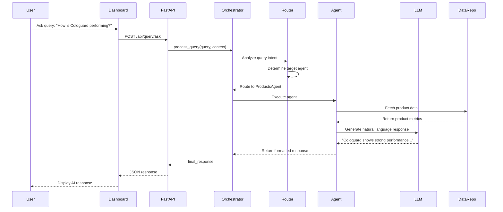
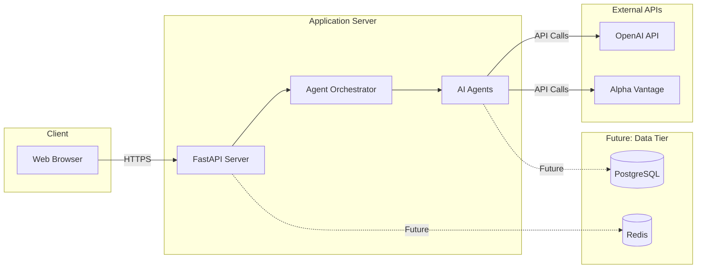
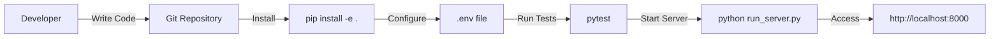

# LeaderDashboard - System Architecture

## Overview

LeaderDashboard is an AI-powered executive dashboard system designed for HealthCare Sciences. It combines traditional business intelligence visualizations with conversational AI capabilities, allowing executives to interact with company data through natural language queries.

## High-Level Architecture

```mermaid
graph TB
    subgraph "Frontend Layer"
        UI[CEO Dashboard HTML/JS]
        Charts[Chart.js Visualizations]
        Chat[AI Chat Interface]
    end

    subgraph "API Layer"
        FastAPI[FastAPI Server :8000]
        Health[/health endpoint]
        Tiles[/api/dashboard/tiles/*]
        Query[/api/query/ask]
    end

    subgraph "Orchestration Layer"
        Orchestrator[Dashboard Orchestrator]
        Router[Query Router]
        Graph[LangGraph Workflow]
    end

    subgraph "Agent Layer"
        ProductsAgent[Products Agent]
        RevenueAgent[Revenue Agent]
        BudgetAgent[Budget Agent]
        SupportAgent[Support Agent]
        WorkforceAgent[Workforce Agent]
        StockAgent[Stock Agent]
        BaseAgent[Base Agent]
    end

    subgraph "Data Layer"
        ProductRepo[Product Repository]
        RevenueRepo[Revenue Repository]
        BudgetRepo[Budget Repository]
        SupportRepo[Support Repository]
        WorkforceRepo[Workforce Repository]
        StockRepo[Stock Repository]
    end

    subgraph "External Services"
        OpenAI[OpenAI API]
        AlphaVantage[Alpha Vantage API]
    end

    UI --> FastAPI
    Charts --> FastAPI
    Chat --> FastAPI

    FastAPI --> Health
    FastAPI --> Tiles
    FastAPI --> Query

    Query --> Orchestrator
    Tiles --> ProductRepo
    Tiles --> RevenueRepo
    Tiles --> BudgetRepo
    Tiles --> SupportRepo
    Tiles --> WorkforceRepo

    Orchestrator --> Router
    Router --> Graph

    Graph --> ProductsAgent
    Graph --> RevenueAgent
    Graph --> BudgetAgent
    Graph --> SupportAgent
    Graph --> WorkforceAgent
    Graph --> StockAgent

    ProductsAgent --> BaseAgent
    RevenueAgent --> BaseAgent
    BudgetAgent --> BaseAgent
    SupportAgent --> BaseAgent
    WorkforceAgent --> BaseAgent
    StockAgent --> BaseAgent

    ProductsAgent --> ProductRepo
    RevenueAgent --> RevenueRepo
    BudgetAgent --> BudgetRepo
    SupportAgent --> SupportRepo
    WorkforceAgent --> WorkforceRepo
    StockAgent --> StockRepo

    BaseAgent --> OpenAI
    StockAgent --> AlphaVantage

    style UI fill:#e1f5ff
    style FastAPI fill:#ffe1e1
    style Orchestrator fill:#fff4e1
    style BaseAgent fill:#e1ffe1
    style OpenAI fill:#f0e1ff
```

## Agent Workflow



## Component Details

### 1. Frontend Layer

**Technology**: HTML, Tailwind CSS, Chart.js, Vanilla JavaScript

**Key Features**:
- Multi-tab interface (Overview, AI Assistant, Calendar, Email, Financial, Operations, People, Projects)
- Real-time data loading and updates
- Interactive charts and visualizations
- AI chat interface for natural language queries
- Notification badges and alerts
- Quick actions and pending approvals

**Main File**: `ceo_dashboard_complete.html`

### 2. API Layer

**Technology**: FastAPI (Python)

**Endpoints**:
- `GET /health` - Health check
- `GET /docs` - Swagger API documentation
- `GET /api/dashboard/tiles/products` - Product performance data
- `GET /api/dashboard/tiles/revenue` - Revenue metrics
- `GET /api/dashboard/tiles/budget` - Budget allocation
- `GET /api/dashboard/tiles/support` - Support ticket data
- `GET /api/dashboard/tiles/workforce` - HR metrics
- `GET /api/dashboard/tiles/all` - All dashboard tiles
- `POST /api/query/ask` - Natural language query processing

**Location**: `healthcare_sciences_dashboard/api/`

### 3. Orchestration Layer

**Technology**: LangGraph

**Components**:
- **DashboardOrchestrator**: Main entry point for query processing
- **Query Router**: Analyzes user intent and routes to appropriate agent
- **LangGraph Workflow**: State machine managing agent execution flow
- **State Management**: Tracks query state, agent data, and responses

**Location**: `healthcare_sciences_dashboard/graph/`

### 4. Agent Layer

**Technology**: Python with LLM integration

**Agents**:
1. **Products Agent** - Analyzes product performance (Cologuard, Oncotype DX, etc.)
2. **Revenue Agent** - Tracks revenue trends and targets
3. **Budget Agent** - Monitors budget allocation and spending
4. **Support Agent** - Analyzes customer support tickets and priorities
5. **Workforce Agent** - Provides HR metrics, headcount, vacancies
6. **Stock Agent** - Fetches real-time stock prices

**Base Agent Features**:
- LLM provider abstraction (OpenAI)
- Prompt template management
- Data formatting and response generation
- Error handling

**Location**: `healthcare_sciences_dashboard/agents/`

### 5. Data Layer

**Technology**: Python repositories (currently mock data)

**Repositories**:
- Product Repository - Product catalog and order metrics
- Revenue Repository - Financial performance data
- Budget Repository - Department budgets and allocations
- Support Repository - Ticket tracking and SLA metrics
- Workforce Repository - Employee data and vacancy tracking
- Stock Repository - Stock price integration

**Future**: Ready for database integration (PostgreSQL, MongoDB, etc.)

**Location**: `healthcare_sciences_dashboard/data/repositories/`

### 6. External Services

**LLM Providers**:
- OpenAI (GPT-4)

**Data Services**:
- Alpha Vantage API - Real-time stock prices
- (Future) HealthCare Sciences API - Production data

## Data Flow

### Dashboard Tile Loading
```
User opens dashboard
→ Frontend requests tiles
→ FastAPI routes to repositories
→ Repositories return mock/real data
→ Frontend renders charts and metrics
```

### AI Query Processing
```
User asks "What's our Q4 revenue?"
→ POST to /api/query/ask
→ Orchestrator creates initial state
→ Router analyzes query → identifies "revenue" intent
→ Graph routes to RevenueAgent
→ RevenueAgent fetches data from RevenueRepository
→ RevenueAgent generates LLM prompt with data
→ LLM returns natural language response
→ Response flows back through orchestrator
→ Frontend displays in chat interface
```

## Technology Stack

### Backend
- **Python 3.x**
- **FastAPI** - Web framework
- **LangGraph** - Agent orchestration
- **LangChain** - LLM abstractions
- **Pydantic** - Data validation
- **python-dotenv** - Configuration management

### Frontend
- **HTML5/CSS3**
- **Tailwind CSS** - UI framework
- **Chart.js** - Data visualization
- **Vanilla JavaScript** - Interactivity

### AI/ML
- **OpenAI GPT-4** - Primary LLM
- **LangGraph** - Multi-agent orchestration

## Configuration

Environment variables (`.env`):
```env
OPENAI_API_KEY=sk-...
MODEL_NAME=gpt-4-turbo-preview
ALPHA_VANTAGE_API_KEY=...
PORT=8000
DEBUG=False
LOG_LEVEL=INFO
```

## Deployment Architecture



## Security Considerations

1. **API Key Management**: Stored in `.env`, not committed to version control
2. **CORS Configuration**: Currently open for development, should be restricted in production
3. **Input Validation**: Pydantic models validate API inputs
4. **Rate Limiting**: Should be implemented for production
5. **Authentication**: Not currently implemented (future enhancement)

## Scalability Considerations

1. **Stateless Design**: Each request is independent
2. **Agent Parallelization**: LangGraph supports concurrent agent execution
3. **Caching Strategy**: Can cache LLM responses and dashboard data
4. **Database Connection Pooling**: Ready for production database integration
5. **Horizontal Scaling**: FastAPI servers can be load-balanced

## Future Enhancements

1. **Real Database Integration**: Replace mock data with PostgreSQL/MongoDB
2. **User Authentication**: Add OAuth/JWT authentication
3. **WebSocket Support**: Real-time dashboard updates
4. **Advanced Analytics**: Machine learning predictions
5. **Multi-tenancy**: Support multiple organizations
6. **Audit Logging**: Track all queries and actions
7. **Advanced Agent Capabilities**: Tool use, memory, function calling
8. **Mobile Responsive Design**: Optimize for mobile devices

## Development Workflow



## Project Structure

```
LeaderDashboard/
├── docs/                           # Documentation
│   └── architecture/               # Architecture documentation
├── healthcare_sciences_dashboard/  # Main application
│   ├── agents/                     # AI agents
│   │   ├── base_agent.py
│   │   ├── products_agent.py
│   │   ├── revenue_agent.py
│   │   ├── budget_agent.py
│   │   ├── support_agent.py
│   │   ├── workforce_agent.py
│   │   └── stock_agent.py
│   ├── api/                        # FastAPI application
│   │   ├── routes/
│   │   └── server.py
│   ├── data/                       # Data layer
│   │   └── repositories/
│   ├── graph/                      # LangGraph orchestration
│   │   ├── graph_builder.py
│   │   ├── nodes.py
│   │   └── state.py
│   ├── prompts/                    # LLM prompts
│   ├── tests/                      # Test suite
│   ├── config.py                   # Configuration
│   ├── dashboard_orchestrator.py   # Main orchestrator
│   ├── main.py                     # Demo script
│   ├── run_server.py               # Server launcher
│   ├── run_demo.py                 # Demo runner
│   └── run_tests.py                # Test runner
├── ceo_dashboard_complete.html     # Frontend dashboard
├── dashboard_simple.html           # Simplified version
└── ceodashboard/                   # Python virtual environment
```

## Key Design Decisions

1. **Multi-Agent Architecture**: Specialized agents for different business domains
2. **LangGraph Orchestration**: Enables complex routing and state management
3. **Provider Abstraction**: Support for multiple LLM providers
4. **Mock Data First**: Rapid prototyping with mock data, easy migration to real data
5. **Monolithic Frontend**: Single HTML file for easy deployment
6. **FastAPI Backend**: Modern, fast, with automatic API documentation
7. **Stateless API**: Easier to scale and maintain

## Performance Metrics

- **Average Query Response Time**: 2-5 seconds (LLM dependent)
- **Dashboard Load Time**: < 1 second (with mock data)
- **Concurrent Users**: Currently designed for single user (CEO)
- **API Throughput**: Limited by LLM API rate limits

## Support and Maintenance

- **Logging**: Configured via LOG_LEVEL environment variable
- **Error Handling**: Graceful degradation with user-friendly messages
- **Testing**: Unit and integration tests in `tests/` directory
- **Documentation**: Inline code comments and this architecture guide
