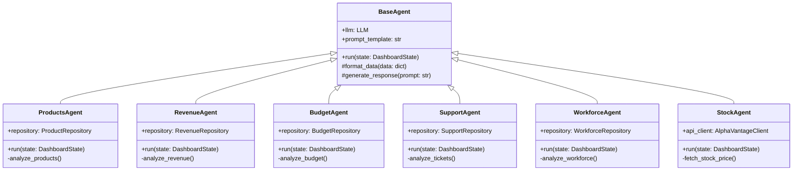

# Architecture Diagrams

## 1. System Architecture Overview

```mermaid
graph TB
    subgraph "Frontend Layer"
        UI[CEO Dashboard HTML/JS]
        Charts[Chart.js Visualizations]
        Chat[AI Chat Interface]
    end

    subgraph "API Layer"
        FastAPI[FastAPI Server :8000]
        Health[/health endpoint]
        Tiles[/api/dashboard/tiles/*]
        Query[/api/query/ask]
    end

    subgraph "Orchestration Layer"
        Orchestrator[Dashboard Orchestrator]
        Router[Query Router]
        Graph[LangGraph Workflow]
    end

    subgraph "Agent Layer"
        ProductsAgent[Products Agent]
        RevenueAgent[Revenue Agent]
        BudgetAgent[Budget Agent]
        SupportAgent[Support Agent]
        WorkforceAgent[Workforce Agent]
        StockAgent[Stock Agent]
        BaseAgent[Base Agent]
    end

    subgraph "Data Layer"
        ProductRepo[Product Repository]
        RevenueRepo[Revenue Repository]
        BudgetRepo[Budget Repository]
        SupportRepo[Support Repository]
        WorkforceRepo[Workforce Repository]
        StockRepo[Stock Repository]
    end

    subgraph "External Services"
        OpenAI[OpenAI API]
        AlphaVantage[Alpha Vantage API]
    end

    UI --> FastAPI
    Charts --> FastAPI
    Chat --> FastAPI

    FastAPI --> Health
    FastAPI --> Tiles
    FastAPI --> Query

    Query --> Orchestrator
    Tiles --> ProductRepo
    Tiles --> RevenueRepo
    Tiles --> BudgetRepo
    Tiles --> SupportRepo
    Tiles --> WorkforceRepo

    Orchestrator --> Router
    Router --> Graph

    Graph --> ProductsAgent
    Graph --> RevenueAgent
    Graph --> BudgetAgent
    Graph --> SupportAgent
    Graph --> WorkforceAgent
    Graph --> StockAgent

    ProductsAgent --> BaseAgent
    RevenueAgent --> BaseAgent
    BudgetAgent --> BaseAgent
    SupportAgent --> BaseAgent
    WorkforceAgent --> BaseAgent
    StockAgent --> BaseAgent

    ProductsAgent --> ProductRepo
    RevenueAgent --> RevenueRepo
    BudgetAgent --> BudgetRepo
    SupportAgent --> SupportRepo
    WorkforceAgent --> WorkforceRepo
    StockAgent --> StockRepo

    BaseAgent --> OpenAI
    StockAgent --> AlphaVantage

    style UI fill:#e1f5ff
    style FastAPI fill:#ffe1e1
    style Orchestrator fill:#fff4e1
    style BaseAgent fill:#e1ffe1
    style OpenAI fill:#f0e1ff
```

## 2. Agent Query Processing Flow


## 3. LangGraph State Machine


## 4. Dashboard Tile Loading Flow


## 5. Component Layer Architecture


## 6. Data Flow: AI Query Processing

```mermaid
flowchart TD
    Start([User Query]) --> Input[Receive Query]
    Input --> InitState[Initialize Dashboard State]
    InitState --> Router{Query Router}

    Router -->|Product| PA[Products Agent]
    Router -->|Revenue| RA[Revenue Agent]
    Router -->|Budget| BA[Budget Agent]
    Router -->|Support| SA[Support Agent]
    Router -->|Workforce| WA[Workforce Agent]
    Router -->|Stock| STA[Stock Agent]
    Router -->|General| AA[Assistant Agent]

    PA --> FetchData1[Fetch Product Data]
    RA --> FetchData2[Fetch Revenue Data]
    BA --> FetchData3[Fetch Budget Data]
    SA --> FetchData4[Fetch Support Data]
    WA --> FetchData5[Fetch Workforce Data]
    STA --> FetchData6[Fetch Stock Data]
    AA --> FetchData7[Fetch Context Data]

    FetchData1 --> BuildPrompt1[Build LLM Prompt]
    FetchData2 --> BuildPrompt2[Build LLM Prompt]
    FetchData3 --> BuildPrompt3[Build LLM Prompt]
    FetchData4 --> BuildPrompt4[Build LLM Prompt]
    FetchData5 --> BuildPrompt5[Build LLM Prompt]
    FetchData6 --> BuildPrompt6[Build LLM Prompt]
    FetchData7 --> BuildPrompt7[Build LLM Prompt]

    BuildPrompt1 --> LLM[Call LLM API]
    BuildPrompt2 --> LLM
    BuildPrompt3 --> LLM
    BuildPrompt4 --> LLM
    BuildPrompt5 --> LLM
    BuildPrompt6 --> LLM
    BuildPrompt7 --> LLM

    LLM --> Format[Format Response]
    Format --> UpdateState[Update State]
    UpdateState --> Response([Return Response])
```



## 7. Agent Class Hierarchy



## 8. Deployment Architecture


## 9. Request-Response Cycle


## 10. Technology Stack Overview


## 11. Error Handling Flow


## 12. Agent Orchestration Pattern


## 13. Future Architecture with Microservices


